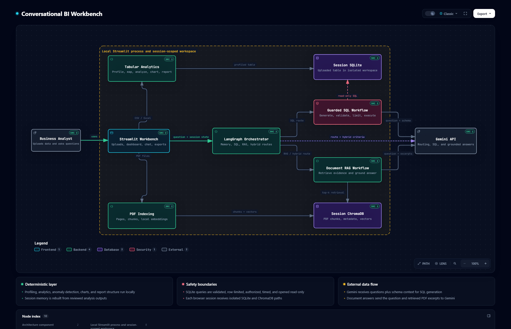

# Conversational Business Intelligence Workbench

A Streamlit application for exploring uploaded CSV, Excel, and PDF files through
deterministic analytics, read-only SQL, document retrieval, and coordinated
conversational workflows.

## What It Does

- Profiles uploaded tabular data and proposes a reviewable canonical schema.
- Runs deterministic summaries, trends, category breakdowns, and Plotly charts.
- Flags unusual numeric patterns with a configurable Isolation Forest model.
- Persists each browser session to its own SQLite and ChromaDB workspace.
- Generates Gemini-backed SQL and executes it through table, column, function,
  row, and execution-time guardrails.
- Retrieves page-aware PDF context with relevance filtering.
- Routes questions through SQL, document RAG, session memory, or a hybrid
  document-plus-data workflow using LangGraph.
- Produces a deterministic business report with on-demand PDF export.

Anomaly results are review candidates, not confirmed fraud or misconduct. The
application is a decision-support workbench, not an autonomous decision maker.

## Architecture

[](.archify/architecture-conversational-bi-20260928-134410/conversational-bi.html)

The diagram is generated from repository-backed source evidence with Archify.
Download and open the [interactive architecture artifact](.archify/architecture-conversational-bi-20260928-134410/conversational-bi.html)
locally to inspect components, trace routes, switch themes, and follow source
references. Its [typed diagram specification](.archify/architecture-conversational-bi-20260928-134410/candidate.json)
is versioned alongside the rendered artifact.

The SQL and RAG components are specialized workflows coordinated by a router.
For questions that explicitly combine uploaded transactions with document
guidance, the hybrid route retrieves the guidance first and then generates a
guarded query using that context. It does not claim autonomous agent consensus.

### Modernization roadmap

The production-structure roadmap is tracked in
[GitHub issue #6](https://github.com/mehaksharma1996/conversational-multi-agent-bi/issues/6).
Its first iteration records the [current-to-target baseline](docs/architecture/modernization-baseline.md),
the [initial API resource model](docs/architecture/api-resource-model.md), and
the [architecture decisions](docs/adr/README.md) that govern the incremental
React, FastAPI, evaluation, observability, governance, and local Docker work.
The validated
[interactive target architecture](.archify/architecture-target-platform-20260928-232755/target-platform.html)
shows how those boundaries fit together.
The existing Streamlit application remains the behavioral reference until the
new product surface demonstrates tested feature parity.

Phase 2 introduces a [framework-neutral tabular core](docs/architecture/framework-neutral-core.md)
under `packages/analytics/`, with typed upload, profile, schema-review, and
analysis commands now used by Streamlit. Provider and repository contracts live
under `packages/connectors/`, and CI prevents these packages from importing UI
or API frameworks.

Phase 3 adds the [versioned FastAPI tabular vertical slice](docs/architecture/fastapi-vertical-slice.md)
under `apps/api/`. It covers local identity, tenant-scoped workspaces, bounded
CSV/Excel upload and sheet discovery, profiling, explicit schema confirmation,
deterministic analysis, health checks, safe request-ID errors, and a committed
OpenAPI contract. The API repository is intentionally process-local at this
stage; durable persistence is deferred and documented.

Phase 4 adds the [React and TypeScript tabular vertical slice](docs/architecture/react-vertical-slice.md)
under `apps/web/`. It uses the committed OpenAPI contract to provide a typed
upload, schema-review, anomaly-configuration, and deterministic-analysis
journey, with responsive styling, accessible controls, component coverage,
and a Playwright critical-path test. Streamlit remains available while later
phases migrate conversational SQL, document retrieval, and exports.

## Local Setup

Python 3.12 through 3.14 is supported. The current verified environment uses
Python 3.14.

```powershell
py -3.14 -m venv .venv
& ".\.venv\Scripts\python.exe" -m pip install -r requirements.lock
Copy-Item .env.example .env
& ".\.venv\Scripts\python.exe" -m streamlit run app.py
```

Run the Phase 3 API locally in a separate terminal:

```powershell
& ".\.venv\Scripts\python.exe" -m uvicorn apps.api.main:app --reload
```

Run the Phase 4 web client in another terminal. Node 24.14 and npm 11.20 are
pinned in `.nvmrc` and `apps/web/package.json`:

```powershell
Set-Location apps/web
npm ci
npm run dev
```

Open `http://127.0.0.1:5173`. Vite proxies `/api` and `/health` to the local
FastAPI process on port 8000, keeping local development same-origin without
introducing a production hosting decision.

Interactive API documentation is available at `http://127.0.0.1:8000/docs`.
The committed [OpenAPI contract](openapi/openapi.json) can be regenerated with
`python -m scripts.generate_openapi`. Until durable resource persistence lands,
run one API process; restarting it clears API-created workspace metadata.

For development tools:

```powershell
& ".\.venv\Scripts\python.exe" -m pip install -r requirements-dev.txt
```

Set `GEMINI_API_KEY` in `.env` to enable SQL generation and document answers.
The deterministic dashboard, analytics, and report structure do not require an
API key.

The first PDF upload may download the configured SentenceTransformer model.

To try the dashboard immediately, upload `sample_data/transactions.csv` and
`sample_data/review_policy.pdf`.

Resource and retention limits can be configured with `MAX_TABULAR_UPLOAD_BYTES`,
`MAX_TABULAR_ROWS`, `MAX_PDF_UPLOAD_BYTES`, `MAX_TOTAL_PDF_BYTES`,
`MAX_PDF_PAGES`, `MAX_DOCUMENT_CHUNKS`, `RETRIEVAL_TOP_K`,
`RETRIEVAL_MAX_DISTANCE`, `SESSION_RETENTION_HOURS`, and
`SESSION_CLEANUP_INTERVAL_MINUTES`. `SQLITE_DB_PATH` and
`CHROMA_PERSIST_DIR` define the non-session defaults; browser sessions are
intentionally stored below `APP_DATA_DIR/sessions/<tenant-id>/<session-id>`
for isolation, where `<tenant-id>` identifies the authenticated user (or a
fixed local-development tenant when authentication is not configured; see
"Authentication" below).

## Quality Checks

```powershell
& ".\.venv\Scripts\python.exe" -m ruff check .
& ".\.venv\Scripts\python.exe" -m ruff format --check .
& ".\.venv\Scripts\python.exe" -m mypy apps config packages scripts src tests
& ".\.venv\Scripts\python.exe" -m pytest --cov --cov-report=term-missing
Set-Location apps/web
npm run lint
npm run typecheck
npm run test
npm run build
npm run test:e2e
```

CI runs the same Python and frontend checks on pushes and pull requests. The
frontend job also verifies that its generated client matches the committed
OpenAPI contract and exercises the critical browser journey. A separate security
job: `pip-audit` against `requirements.lock` (with a documented, reviewed
exception for four chromadb advisories scoped to its standalone HTTP server,
which this app never runs) and a `gitleaks` secret scan. Dependabot opens
weekly update PRs for Python and frontend dependencies and GitHub Actions.
`requirements.txt` pins direct runtime dependencies; `requirements.lock`
captures the fully resolved, tested environment.

## Example Questions

```text
Show the top five merchants by total amount.
What analysis is possible with this dataset?
Show me the SQL used for the previous question.
According to the uploaded policy, which transaction types require escalation?
Which uploaded transactions appear to match the escalation policy?
```

The final question activates the hybrid route when both table data and document
context are available.

## Authentication

The app supports Streamlit's native OIDC login (`st.login()`/`st.user`) for
gating access and scoping storage per authenticated user. To enable it, copy
`.streamlit/secrets.toml.example` to `.streamlit/secrets.toml` and fill in a
real identity provider's OAuth client credentials and OIDC discovery URL
(Google, Microsoft Entra, Auth0, Okta, or any OIDC-compliant provider).

If `.streamlit/secrets.toml` does not exist, the app runs without a login
wall under a single fixed local-development tenant, matching today's
single-user local workflow. A sidebar warning makes this mode visible. A
*malformed* `secrets.toml` (present but invalid) fails loudly instead of
silently falling back to the unauthenticated mode, so a real misconfiguration
in a hosted deployment cannot be mistaken for intentional local-dev use.

Each authenticated identity's storage is namespaced under a tenant id derived
from that identity's stable OIDC `sub` claim, never from anything client-
supplied, so one signed-in user cannot reach another's workspace. CSRF
protection and secure session cookies are provided by Streamlit's native
auth implementation (an Authlib-backed OAuth2 `state` parameter during login
plus a signed, expiring identity cookie) rather than custom code. A user's
workspace does not currently persist or share across multiple browser tabs
or devices — each tab still gets its own ephemeral session within that
user's tenant.

## Encryption at Rest

Tabular SQLite storage can be encrypted at rest via SQLCipher. Set
`APP_ENCRYPTION_KEY` to a 64-character hex string (32 bytes; generate one with
`python -c "import secrets; print(secrets.token_hex(32))"`). Without it, the
app runs with unencrypted SQLite storage and shows a sidebar warning. A key
present but not exactly 64 hex characters fails loudly at startup rather than
silently falling back.

This covers the tabular SQLite database only. The Chroma vector store is not
encrypted: Chroma manages its own internal storage engine, and embedding
vectors must remain in plaintext for similarity search to function regardless
of any field-level encryption of document text or metadata. Vector-store
encryption is a deferred follow-up, not implemented here.

Stale session directories are identified by a per-session heartbeat file
(updated on every active render), not by directory modification time, which
never updates from writes to files inside it. Cleanup runs periodically
(`SESSION_CLEANUP_INTERVAL_MINUTES`, default 15) rather than only when a new
browser tab starts, and every removal is recorded in
`APP_DATA_DIR/cleanup_audit.log`.

## Gemini Data Retention

Before asking any question while Gemini is configured, the chat panel shows a
one-time consent notice describing what may be sent (question text, table
schema, sample values, and/or retrieved document excerpts); it must be
accepted before the chat input is enabled for that session.

For billing-enabled (paid) Gemini API projects, prompts and responses are not
used to improve Google's products by default, and logs are retained for a
default maximum of 55 days (configurable down to 7/14/28 days in AI Studio,
with a Zero Data Retention option for eligible accounts). Free-tier terms
differ. These are Google's terms, not this project's, and can change — see
the current policy at
[ai.google.dev/gemini-api/docs/logs-policy](https://ai.google.dev/gemini-api/docs/logs-policy).

Two settings reduce what is sent regardless of provider terms:

- `GEMINI_EXCLUDE_SAMPLE_VALUES=true` omits real column sample values from
  SQL-generation prompts (schema and data types are still sent).
- Text sent to Gemini (SQL sample values, prior-question history, and
  retrieved document excerpts) passes through best-effort regex-based PII
  redaction first (`src/utils/pii_redaction.py`) — emails, SSN-like numbers,
  phone-like numbers, and Luhn-valid card numbers are replaced with
  `[REDACTED_*]` markers. This is defense-in-depth, not a guarantee: it will
  not catch names, addresses, or other free-text PII.

`LOCAL_ONLY_MODE=true` is the only complete guarantee: it disables every
Gemini-backed code path (SQL generation, document RAG, hybrid queries, and
LLM-based question routing) even if `GEMINI_API_KEY` is set, forcing the app
back to deterministic analytics, the dashboard, and reports only.

By default, server logs record only the route, elapsed time, and
question/SQL length for each answered question — never the raw question or
generated SQL text. Set `DEBUG_LOG_RAW_CONTENT=true` to additionally log raw
content at `DEBUG` level for local troubleshooting; leave it unset in any
shared or hosted deployment.

The same privacy-safe structured logging covers retrieval rejection counts,
LLM failures and query timeouts (each with a correlation ID, see "Data and
Security Boundaries" below), storage usage in bytes, and cleanup deletion
failures — all as counts and identifiers, never question or document
content. There is no metrics exporter (e.g. Prometheus); these are plain log
lines intended for a log-based metrics pipeline (CloudWatch Logs Insights,
Datadog, Grafana Loki, etc.) if one is available in your deployment.

## Data and Security Boundaries

- Uploaded table and vector data are isolated under a per-tenant, per-session
  directory (see "Authentication" above).
- Removing an upload clears its derived state; **Reset session data** clears the
  complete current workspace.
- SQLite is opened read-only for user queries and constrained to the current
  session table and columns.
- Query results are capped in SQL and execution is interrupted after a deadline.
- Upload size, row, PDF page, and document chunk limits protect local resources
  and are enforced before the corresponding parsing work happens.
- CSV/Excel downloads of query results neutralize values beginning with `=`,
  `+`, `-`, or `@` to prevent spreadsheet-formula injection when opened.
- Unexpected internal errors (storage, PDF report generation, ad-hoc SQL, and
  Gemini request failures) are shown to users as a generic message plus a
  correlation ID; full exception detail is logged server-side only.
- A failed tabular upload or PDF indexing attempt leaves the previous
  successfully loaded data usable and offers a Retry button, rather than
  silently discarding it. PDF indexing builds into a staging collection and
  only swaps it in after every chunk succeeds, so a failure never leaves a
  partial document index.
- Document retrieval rejects candidates beyond `RETRIEVAL_MAX_DISTANCE`
  (default 0.7, empirically evaluated) rather than always returning the
  nearest chunks regardless of relevance, deduplicates near-identical
  overlapping chunks, and reports how many candidates were considered versus
  rejected as evidence for a "no relevant information" answer.
- RAG answers are checked after generation: a citation to a source number
  outside the retrieved set, or a quoted passage that doesn't actually
  appear in the retrieved text, is flagged in the answer as unverified
  rather than trusted at face value. This is a structural check (citation
  numbers, substring matches), not a semantic proof that every claim is
  correct. The hybrid route's document-to-criteria extraction only accepts
  an allowlisted set of keys/types within a size limit, and drops any string
  value that doesn't trace back to the retrieved document text — defense
  against a document trying to inject extra instructions or criteria that
  aren't actually stated in it. The hybrid route additionally checks whether
  the generated SQL literally references at least one of the extracted
  criteria values, flagging it when it doesn't — a provenance check (does
  the SQL mention the criteria at all), not a semantic proof that the SQL's
  logic is correct.
- Chat history is capped at `MAX_CHAT_MESSAGES` (default 50); messages beyond
  `MAX_CHAT_DATAFRAMES_RETAINED` (default 10) keep their text but drop the
  full result DataFrame, bounding memory growth in long sessions.
- A schema-mapping suggestion below 50% confidence (e.g., an unnamed numeric
  column guessed as "amount") defaults to "Not mapped" rather than being
  applied automatically; using it requires explicitly selecting it in the
  schema review panel, and a warning is shown while it's in use.
- Anomaly detection reports model-flagged and rule-flagged rows separately
  (a row can be flagged by either or both) along with the model's anomaly
  score distribution, rather than presenting a single combined flag.
- Currency, percentage, and date-format normalization is lossy (the original
  string formatting isn't retained), so a warning is shown per affected
  column: which currency symbol was removed, mixed currency symbols in one
  column, a percentage-to-fraction conversion, or a day/month order that
  couldn't be determined from the data. This is disclosure, not full
  reversibility — locale/timezone selection and a real parsing preview are
  not implemented.
- `.env`, session databases, vector indexes, reports, and test artifacts are
  excluded from Git.

Gemini receives the user question and schema information for SQL generation. For
document questions, the retrieved PDF excerpts are also sent to Gemini. Do not
upload sensitive material unless this data flow is acceptable for your use case.

This project supports optional authentication and tabular-data encryption at
rest (see "Authentication" and "Encryption at Rest" above) but does not yet
provide Chroma vector-store encryption or enterprise retention controls. Add
those controls before hosting it for untrusted users.

## Repository Layout

- `app.py`: Streamlit entry point and session initialization.
- `apps/api/`: versioned FastAPI application and HTTP contracts.
- `apps/web/`: React and TypeScript web client for the migrated vertical slice.
- `src/ui/`: upload, dashboard, report, and chat interfaces.
- `src/profiling/`: profiling, schema mapping, and capability readiness.
- `src/analytics/`: deterministic analytics and anomaly detection.
- `src/storage/`: per-session SQLite persistence and guarded querying.
- `src/documents/`: page-aware chunking, embeddings, retrieval, and ChromaDB.
- `src/agents/`: SQL, document-answering, and report workflows.
- `src/orchestration/`: LangGraph routing and hybrid coordination.
- `src/memory/`: state lifecycle and conversational memory.
- `packages/analytics/`: framework-neutral tabular workflow commands and service.
- `packages/connectors/`: provider, identity, audit, and persistence ports.
- `openapi/`: generated, reproducibility-checked API contract.
- `tests/`: unit and Streamlit integration tests.

## Current Limitations

- Schema mapping remains heuristic until confirmed by the user.
- Retrieval relevance is model- and document-dependent.
- Hybrid policy-to-SQL translation must be reviewed before operational use.
- Scanned PDFs are detected and rejected with a specific message asking for
  OCR before upload; OCR itself is not performed by this app.
- PDF reports use a bundled Unicode font covering Latin Extended, Greek, and
  Cyrillic scripts, but not CJK, Arabic, or other non-alphabetic scripts.
- Gemini availability, quotas, and responses are external dependencies.
