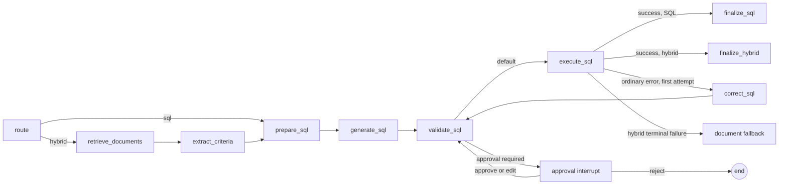

# LangGraph SQL workflow and approval interrupt

Issue #24 makes SQL generation, validation, execution, and correction visible graph steps. It also
adds an optional human approval boundary for hybrid document-to-SQL questions. Direct SQL questions
keep their existing behavior; approval is opt-in and applies only to the hybrid route.

## Graph topology

The correction counter starts at zero and permits one transition through `correct_sql`. A second
ordinary execution failure terminates with `SQLAgentError`. Unsafe validation and query timeouts
never enter the correction loop. If approval is enabled and a correction produces different SQL,
the corrected proposal interrupts again before it can execute.

## Interrupt and resume sequence

1. The browser sends `require_sql_approval: true` with a question.
2. FastAPI generates the message ID and a private checkpoint thread ID from trusted tenant,
   workspace, and message identity. The thread ID is never returned to the browser.
3. The hybrid graph retrieves evidence, extracts bounded criteria, generates SQL, and applies the
   normal read-query guard.
4. LangGraph interrupts before execution. The API stores a `pending_approval` message containing
   the proposed SQL and content-free provenance.
5. `POST /api/v1/messages/{message_id}/approval` accepts `approve` or `reject` and an optional SQL
   edit. Repository ownership is checked before the server looks up its checkpoint.
6. Approval, including unchanged SQL, returns through `validate_sql`. Rejection ends without rows.
   An unsafe edit is terminally rejected and its checkpoint is removed.

Pending and rejected messages cannot be exported. Approval audit events contain tenant and message
identity, outcome, and only an `sql_edited` boolean; they never contain SQL, questions, criteria,
rows, prompts, excerpts, or checkpoint payloads.

## Storage and lifecycle boundary

The FastAPI application owns one process-local `InMemorySaver`. Workspace deletion and expiry
delete every registered checkpoint thread. Completed, rejected, and failed decisions also delete
their thread immediately.

This is deliberately not restart-durable. Restarting the API loses pending checkpoints, just as it
loses the current process-local resource records. Durable checkpoint storage, migrations, recovery,
and multi-process coordination belong to issue #12; this implementation must not be presented as a
substitute for that persistence work.

## Verification

Topology and loop-bound tests exercise every explicit SQL node, one correction, correction
exhaustion, unsafe validation, and timeout termination. API tests cover default-off behavior,
pending/approve/reject, safe and unsafe edits, repeated decisions, tenant isolation, audit content,
and workspace cleanup. The deterministic evaluation suite and fake-provider Playwright journey
exercise the interrupt and resume path without a live model.
