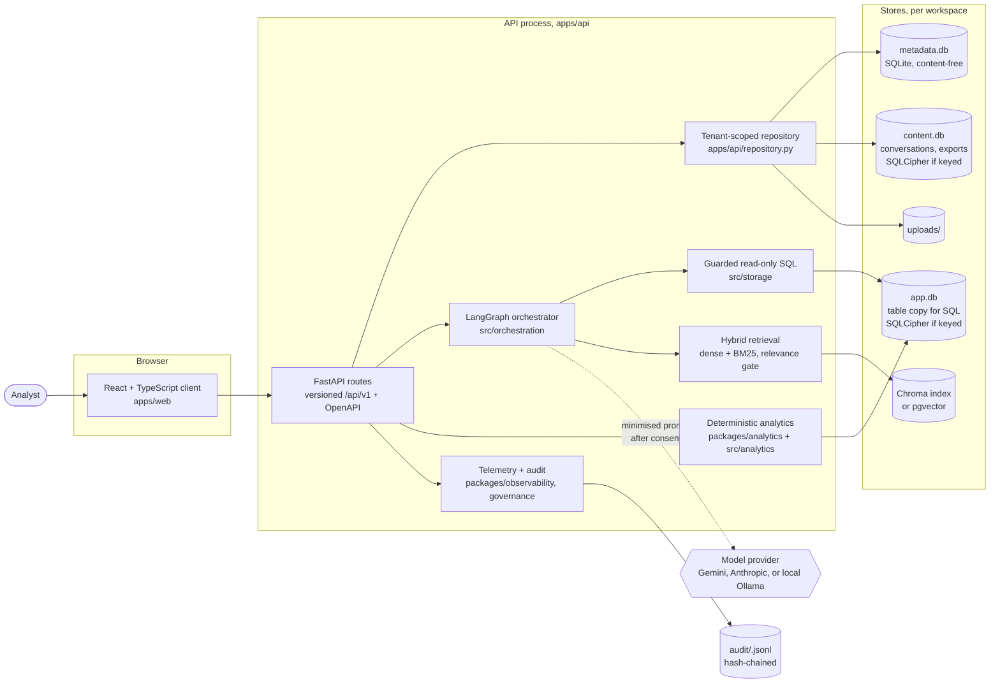
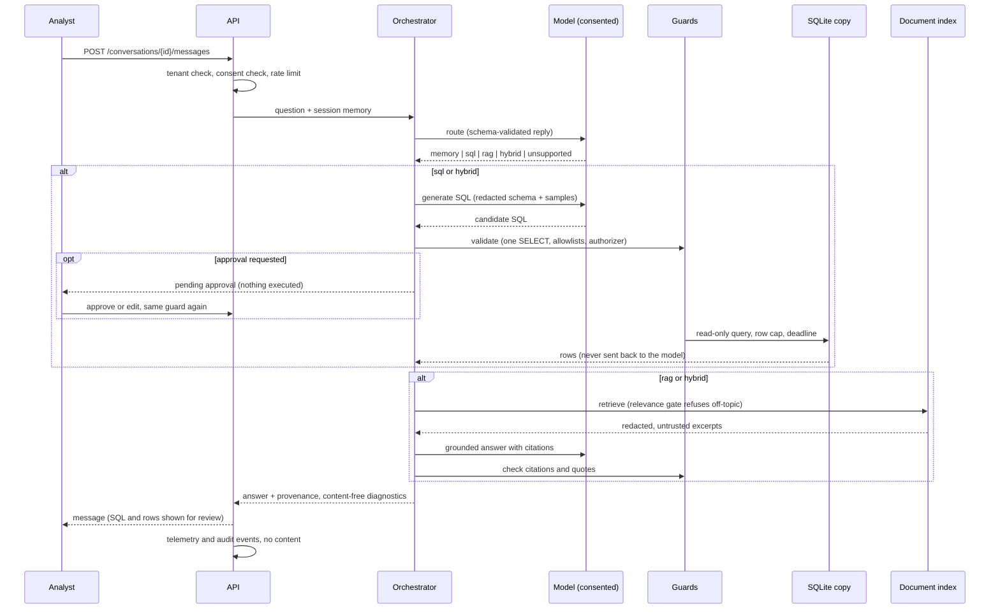
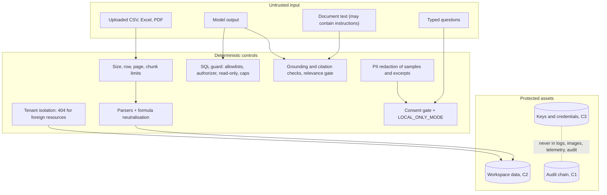
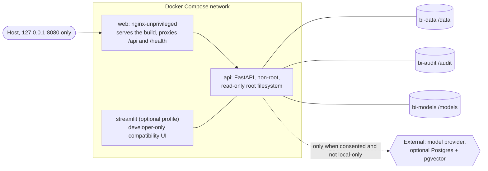

# System overview: architecture, data flow, trust boundaries, containers

Current-state diagrams for the React/FastAPI product (ADR 0011), written from the repository as of
2026-10-06. Mermaid renders on GitHub. Each diagram names the code that implements it so a reviewer can check
it; where something is a target rather than a fact, it is labelled **Target** and listed in
[Current versus target](#current-versus-target). The older PNG (`conversational-bi-architecture.png`) predates
the React/FastAPI split and is kept only as history.

## 1. Components

Deterministic code does everything that touches data or enforces policy; the model only drafts SQL, routes a
question, extracts criteria, and writes a grounded answer, and every model output passes a deterministic check
before it has any effect (see the [walkthrough](../portfolio-walkthrough.md)).

## 2. Data flow for a question

## 3. Trust boundaries

Boundaries and what protects each are listed in the [threat model](../security/threat-model.md); data classes
and where each lives are in [data classification](../governance/data-classification.md).

## 4. Container topology

Only the web port is published, on loopback; the API is never published, and the proxy does not expose
`/metrics`. Images are digest-pinned, non-root, scanned in CI, and carry no secrets
([local containers](../operations/local-containers.md), [image scanning](../security/image-scanning.md)).

## Current versus target

| Area | Current | Target |
|---|---|---|
| Identity | Trusted local identity (loopback) or OIDC bearer/browser session | Live IdP verification, then lifting the loopback restriction (#9) |
| Persistence | Single node; SQLite metadata + per-workspace stores; durable across restart (ADR 0022) | Multi-process or hosted deployment would need a coordinated store (not planned) |
| Vector store | Chroma (unencrypted, ADR 0021 waiver to 2027-01-31) or pgvector | Encrypted index or managed database encryption |
| Execution | In-process with a bounded job contract (ADR 0020) | A worker only if measurements justify it |
| Observability | Structured logs, opt-in Prometheus metrics, hash-chained audit | Trace export and a scraper profile (#15) |
| Evaluation | Offline deterministic gate, advisory judge | Calibrated real-model evaluation (#14) |
| Retrieval | Dense + BM25 with a relevance gate | Cross-encoder reranking, query rewriting (#26) |
